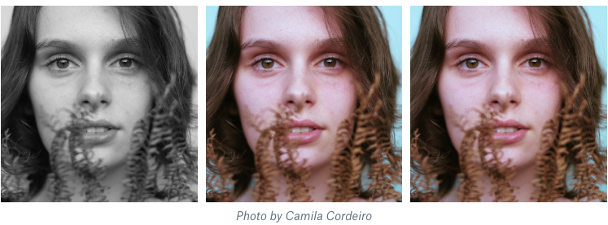
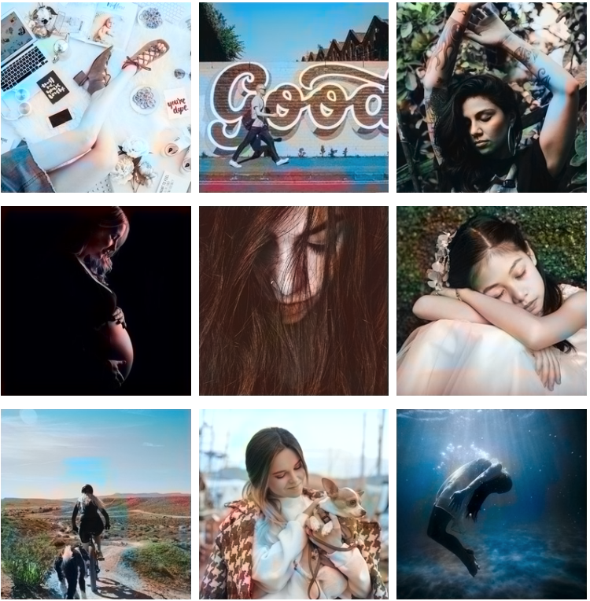
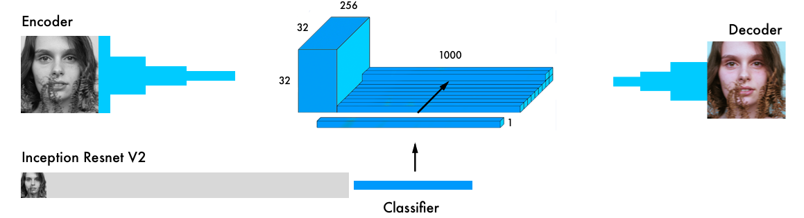
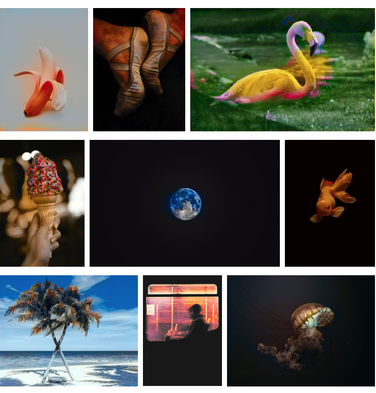

---

**A detailed tutorial covering the code in this repository:** ["Coloring Black and White photos with Neural Networks"](https://blog.floydhub.com/colorizing-b&w-photos-with-neural-networks/)

## Alpha Version

## Beta Version

## Full Version

## GAN Version

## **Run the code on FloydHub**

Click this button to open a [Workspace](https://blog.floydhub.com/workspaces/) on [FloydHub](https://www.floydhub.com/?utm_medium=readme&utm_source=colornet&utm_campaign=aug_2018) where you will find the same environment and dataset used for the *Full version*. 

## Acknowledgments
- Thanks to IBM for donating computing power through their PowerAI platform
- The full-model is a reproduction of Baldassarre alt el., 2017. [Code](https://github.com/baldassarreFe/deep-koalarization) [Paper](https://arxiv.org/abs/1712.03400)
- The advanced model is inspired by the [pix2pix](https://arxiv.org/abs/1611.07004), [pix2pixHD](https://github.com/NVIDIA/pix2pixHD), [SA-GAN](https://arxiv.org/abs/1805.08318), and [DeOldify](https://github.com/jantic/DeOldify) models. 
